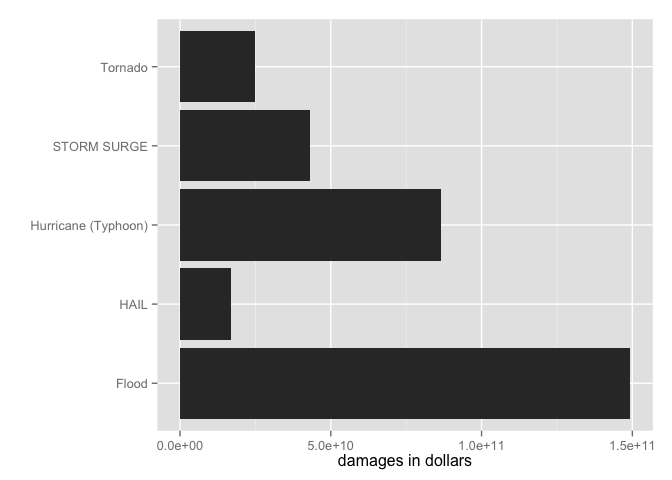

# NEED TITLE HERE
Michael Krämer  
02.11.2015  

TITLE GOES HERE
========================

## Synopsis
The report targets the questions what kind of weather incidents have the highest impact on population health and which cause the largest economic damage. What I found out.

## Data processing

### Loading and preprocessing the data
The data is provided by the National Climatic Data Center and will be automatically downloaded and extracted locally by the script. The file is read completely into R then.


```r
# load libs
suppressPackageStartupMessages(library(dplyr))
suppressPackageStartupMessages(library(R.utils))
library(ggplot2)
library(knitr)
library(xtable)
library(lubridate)
library(scales)
```

```r
# getting, unzipping of data
download.file("https://d396qusza40orc.cloudfront.net/repdata%2Fdata%2FStormData.csv.bz2", destfile="repdata-data-StormData.csv.bz2", method="curl")
bunzip2("repdata-data-StormData.csv.bz2", overwrite = TRUE, remove=FALSE)
```

```r
# reading of data
all_data <- tbl_df(read.csv("repdata-data-StormData.csv", stringsAsFactors = FALSE))
```

### Further processing
First, the data set is filtered so that events which neither caused health or economic damage are disgarded. Further, the data set is filtered so that only events since 1996 are considered. In earlier days, only a very limited selection of events was recorded which makes the data unsuitable for investigation of summaries grouped by event types (see Appendix for details).

Because the investigation is focused on the event types, fatalities, injuries, property damage and crop damage values only, the other columns are dropped.


```r
harm_data <- all_data %>% filter(FATALITIES > 0 | INJURIES > 0 | PROPDMG > 0 | CROPDMG > 0)
harm_year_data <- mutate(harm_data, YEAR = year(parse_date_time(BGN_DATE, "m*!d!Y! H!M!S!"))) # save data of all years for appendinx
harm_data <- filter(harm_year_data, YEAR > 1995) %>%
    select(EVTYPE, FATALITIES, INJURIES, PROPDMG, PROPDMGEXP, CROPDMG, CROPDMGEXP, YEAR)
```

Unfortunately, the remaining data has still many typos or minor differences in the values of EVTYPE variable, therefore follows an attempt to unify those values by using regular expressions. It does not aim to achieve a 100% solution, but focusses on those values that cause major damages. To figure those out, the list was manually viewed in R Studio.
The correct values were taken from the National Weather Service [Storm Data Documentation](https://d396qusza40orc.cloudfront.net/repdata%2Fpeer2_doc%2Fpd01016005curr.pdf) in Section 2.1.1 and is comprehensively saved in the project repository as evtypes.csv.


```r
harm_data$EVTYPE <- gsub("^(THUNDER|TSTM).*$", replacement = "Thunderstorm Wind", x = harm_data$EVTYPE)
harm_data$EVTYPE <- gsub("^(WILD).*$", replacement = "Wildfire", x = harm_data$EVTYPE)
harm_data$EVTYPE <- gsub("^(WIN.*STOR).*$", replacement = "Winter Storm", x = harm_data$EVTYPE)
harm_data$EVTYPE <- gsub("^(WINTER W|WINTR).*$", replacement = "Winter Weather", x = harm_data$EVTYPE)
harm_data$EVTYPE <- gsub("^(HURRI).*$", replacement = "Hurricane (Typhoon)", ignore.case = TRUE, x = harm_data$EVTYPE)
harm_data$EVTYPE <- gsub("^.*(FLASH).*$", replacement = "Flash Flood", ignore.case = TRUE, x = harm_data$EVTYPE)
harm_data$EVTYPE <- gsub("^.*(FLOOD).*$", replacement = "Flood", x = harm_data$EVTYPE)
harm_data$EVTYPE <- gsub("^MARINE (TSTM|THUND).*$", replacement = "Marine Thunderstorm Wind", ignore.case = TRUE, x = harm_data$EVTYPE)
harm_data$EVTYPE <- gsub("^MARINE.*HIGH.*$", replacement = "Marine High Wind", ignore.case = TRUE, x = harm_data$EVTYPE)
harm_data$EVTYPE <- gsub("^MARINE.*$", replacement = "Marine Strong Wind", x = harm_data$EVTYPE)
harm_data$EVTYPE <- gsub("^.*surf.*$", replacement = "High Surf", ignore.case = TRUE, x = harm_data$EVTYPE)
harm_data$EVTYPE <- gsub("^HIGH WI.*$", replacement = "High Wind", ignore.case = TRUE, x = harm_data$EVTYPE)
harm_data$EVTYPE <- gsub("^HEAT.*$", replacement = "Heat", ignore.case = TRUE, x = harm_data$EVTYPE)
harm_data$EVTYPE <- gsub("^EXC.*HEAT.*$", replacement = "Excessive Heat", ignore.case = TRUE, x = harm_data$EVTYPE)
harm_data$EVTYPE <- gsub("^TORN.*$", replacement = "Tornado", ignore.case = TRUE, x = harm_data$EVTYPE)
harm_data$EVTYPE <- gsub("^EXT.*COLD.*$", replacement = "Extreme Cold/Wind Chill", ignore.case = TRUE, x = harm_data$EVTYPE)
harm_data$EVTYPE <- gsub("^AVAL.*$", replacement = "Avalanche", ignore.case = TRUE, x = harm_data$EVTYPE)
harm_data$EVTYPE <- gsub("^.*LIGHTN.*$", replacement = "Lightning", ignore.case = TRUE, x = harm_data$EVTYPE)
harm_data$EVTYPE <- gsub("^[^E].*OLD.*$", replacement = "Cold/Wind Chill", ignore.case = TRUE, x = harm_data$EVTYPE)
harm_data$EVTYPE <- gsub("^STRONG.*$", replacement = "Strong Wind", ignore.case = TRUE, x = harm_data$EVTYPE)
harm_data$EVTYPE <- gsub("^RIP.*$", replacement = "Rip Current", ignore.case = TRUE, x = harm_data$EVTYPE)
harm_data$EVTYPE <- gsub("^ICE ST.*$", replacement = "Ice Storm", ignore.case = TRUE, x = harm_data$EVTYPE)
harm_data$EVTYPE <- gsub("^TROPICAL ST.*$", replacement = "Tropical Storm", ignore.case = TRUE, x = harm_data$EVTYPE)
harm_data$EVTYPE <- gsub("^SURGE.*$", replacement = "Storm Surge/Tide", ignore.case = TRUE, x = harm_data$EVTYPE)
```

This shows a dataset which still has some clutter, but in regards to the most impactful events it is meaningful.

The values for property and crop damage are recorded with an external magnitude like k (1000) or m(1000000). To be able to calculate with them, an effective value will be calculated.


```r
get_multiplier <- function(x)
{
    m <- 0;
    if (x == "K") {
        m <- 1000
    } else {
        if (x == "M") {
            m <- 1000000
        } else {
            if (x == "B") {
                m <- 1000000000
            }
        }
    }
    m
}
harm_data <- mutate(harm_data, PROPEFF = PROPDMG * sapply(PROPDMGEXP, get_multiplier), CROPEFF = CROPDMG * sapply(CROPDMGEXP, get_multiplier))
```

## Results

### Population Health
> Across the United States, which types of events (as indicated in the EVTYPE variable) are most harmful with respect to population health?

The next step is to find the event types that cause most population harm. Since I don't want to employ a measure to compare deaths and injuries, I decided to figure out the 5 most harmful event types regarding deaths and injuries separately and combine these types in a unique list. The assumption is that there will be a large overlap. 


```r
# summarize data to sum up deaths and injuries by EVTYPE
harm_sum <- harm_data %>% group_by(EVTYPE) %>% summarize(fatal = sum(FATALITIES), injured = sum(INJURIES)) %>% arrange(desc(fatal))

# find 10 most severe EVTYPES causing deaths and injuries. Combine then in a unique list.
health_types <- unique(c(head(harm_sum$EVTYPE, n=5), head(arrange(harm_sum, desc(injured))$EVTYPE, n=5)))
health_types
```

```
## [1] "Excessive Heat"    "Tornado"           "Flash Flood"      
## [4] "Lightning"         "Rip Current"       "Flood"            
## [7] "Thunderstorm Wind"
```

This shows that the two lists of 5 types each combine to 7 unique event types.

Further, the list is filtered to these types and recombined into a long format to fit for the plot.


```r
harm_sum_f <- harm_sum %>% filter(EVTYPE %in% health_types)
health_result <- rbind(data.frame(EVTYPE = harm_sum_f$EVTYPE, count = harm_sum_f$fatal, sev = "FATAL"), data.frame(EVTYPE = harm_sum_f$EVTYPE, count = harm_sum_f$injured, sev = "INJURED"))
```

The most harmful event type causing deaths is Excessive Heat (1797 deaths, 6391 injuries) while Tornado causes most injuries (1511 deaths, 20667 injuries) in the time frame from 1996 to 2012.


```r
ggplot(health_result, aes(x = EVTYPE, y = count, fill = sev)) + geom_bar(stat = "identity") + xlab("") + ylab("# of deaths / injuries") + coord_flip()
```

 

### Economic damage
Summing the economic damages leads to another list, in which the following 5 events have the most impact.


```r
# summarize data to sum up economic damage by EVTYPE
damage_sum <- harm_data %>% group_by(EVTYPE) %>% summarize(damage = sum(PROPEFF) + sum(CROPEFF)) %>% arrange(desc(damage))

damage_types <- head(damage_sum$EVTYPE, n=5)
damage_types
```

```
## [1] "Flood"               "Hurricane (Typhoon)" "STORM SURGE"        
## [4] "Tornado"             "HAIL"
```

Further, the list is filtered to these types and recombined into a long format to fit for the plot.


```r
damage_sum_f <- damage_sum %>% filter(EVTYPE %in% damage_types)
```

The most financial impact is caused by Flood (1493 billion dollars damage) while Hurricane (Typhoon) (865 billion dollars damage) is the second. All measures are totals of the time frame 1996 to 2012.


```r
ggplot(damage_sum_f, aes(x = EVTYPE, y = damage)) + geom_bar(stat = "identity") + xlab("") + ylab("damages in dollars") + coord_flip()
```

 

# Appendix

## Population health impacts by years

To check out how damages to population health are spread over the years, the sum of injuries and fatalities per year should be examined.


```r
# compare years
health_year_sum <- harm_year_data %>% group_by(YEAR) %>% summarize(fatal = sum(FATALITIES), injured = sum(INJURIES)) %>% arrange(YEAR)
health_year_result <- rbind(data.frame(year = health_year_sum$YEAR, count = health_year_sum$fatal, sev = "FATAL"), data.frame(year = health_year_sum$YEAR, count = health_year_sum$injured, sev = "INJURED"))
```

```r
ggplot(health_year_result, aes(x = year, y = count, fill = sev)) + geom_bar(stat = "identity", position = "dodge") + xlab("Years") + geom_vline(xintercept = c(1954, 1995))
```

 

As described at [National Storm Events Database](http://www.ncdc.noaa.gov/stormevents/details.jsp) the data until 1954 only covers only tornado events and from 1955 to 1995 only tornado, thunderstorms and hail events. However, there were other events in these periods as well, but they were not reported. To break down the damage to population health by event type it makes not much sense to include the data from before 1996 because it would significantly bias the results towards those event types that were recorded over a longer period of time.

## Report Repository

All scripts, their history and possibly necessary data can be found in the [report repository](https://github.com/mkraemerxcoursera/RepData_PeerAssessment2) on Github.
